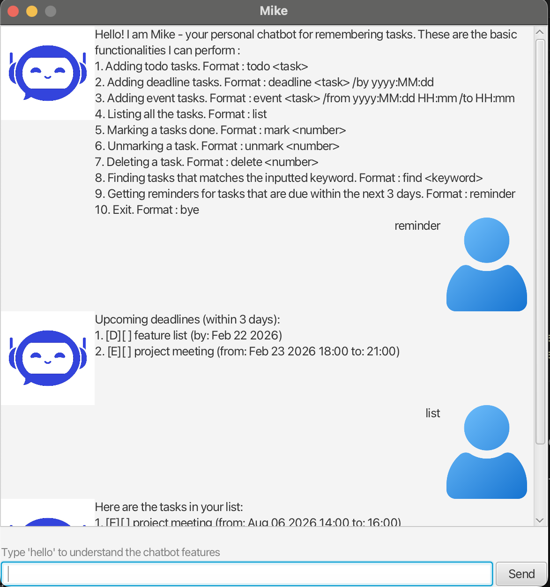

# Mike Chatbot

Mike is a simple chatbot application designed to help users manage their tasks, deadlines, and events. It provides a user-friendly interface and supports various commands to interact with the chatbot.

## Features

- **Task Management**: Add, delete, mark, and unmark tasks.
- **Deadline Tracking**: Add tasks with deadlines and get reminders for upcoming deadlines within the next 3 days.
- **Event Scheduling**: Add events with start and end times and get notified about events happening soon.
- **Search Functionality**: Find tasks containing specific keywords.
- **Graphical User Interface (GUI)**: Interact with Mike through an intuitive and easy-to-use GUI.

## Commands

1. **Add a Todo**:  
   Format: `todo TASK_DESCRIPTION`  
   Example: `todo read book`

2. **Add a Deadline**:  
   Format: `deadline TASK_DESCRIPTION /by yyyy:MM:dd`  
   Example: `deadline submit assignment /by 2023-10-15`

3. **Add an Event**:  
   Format: `event TASK_DESCRIPTION /from yyyy:MM:dd HH:mm /to HH:mm`  
   Example: `event team meeting /from 2023-10-15 14:00 /to 16:00`

4. **List Tasks**:  
   Command: `list`  
   Displays all tasks in the list.

5. **Mark Task as Done**:  
   Format: `mark INDEX`  
   Example: `mark 2`

6. **Unmark Task as Not Done**:  
   Format: `unmark INDEX`  
   Example: `unmark 2`

7. **Delete a Task**:  
   Format: `delete INDEX`  
   Example: `delete 3`

8. **Find Tasks**:  
   Format: `find KEYWORD`  
   Example: `find book`

9. **Reminders**:  
   Command: `reminder`  
   Displays upcoming deadlines and events within the next 3 days.

10. **Exit**:  
    Command: `bye`  
    Exits the application.

## How to Run

1. Clone the repository:

   ```bash
   git clone https://github.com/pr8190/ip.git
   cd ip
   ```

2. Compile the application:

   ```bash
   javac -cp .;path/to/javafx-sdk/lib/* -d bin src/main/java/**/*.java
   ```

3. Run the application:

   ```bash
   java -jar Mike.jar
   ```

   Replace `path/to/javafx-sdk` with the actual path to your JavaFX SDK.

## Screenshots



## Requirements

- Java 17
- JavaFX SDK

## Acknowledgements

- JavaFX for the GUI framework
- Icons from [Flaticon](https://www.flaticon.com/)
- Freepik for chatbot images

## License

This project is licensed under the MIT License.
